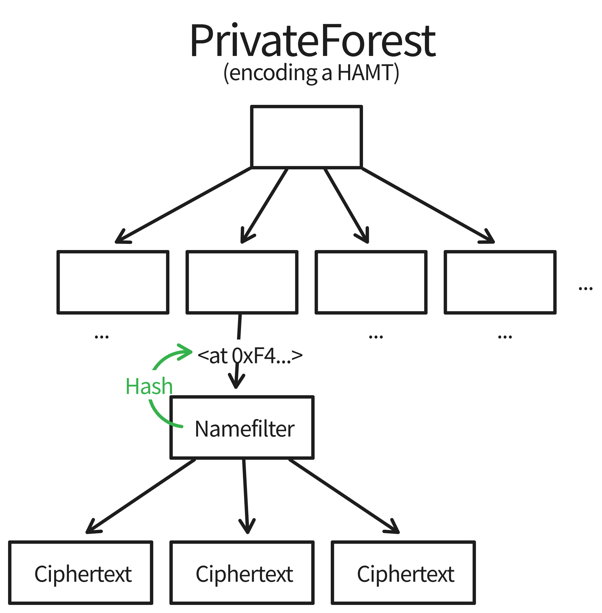
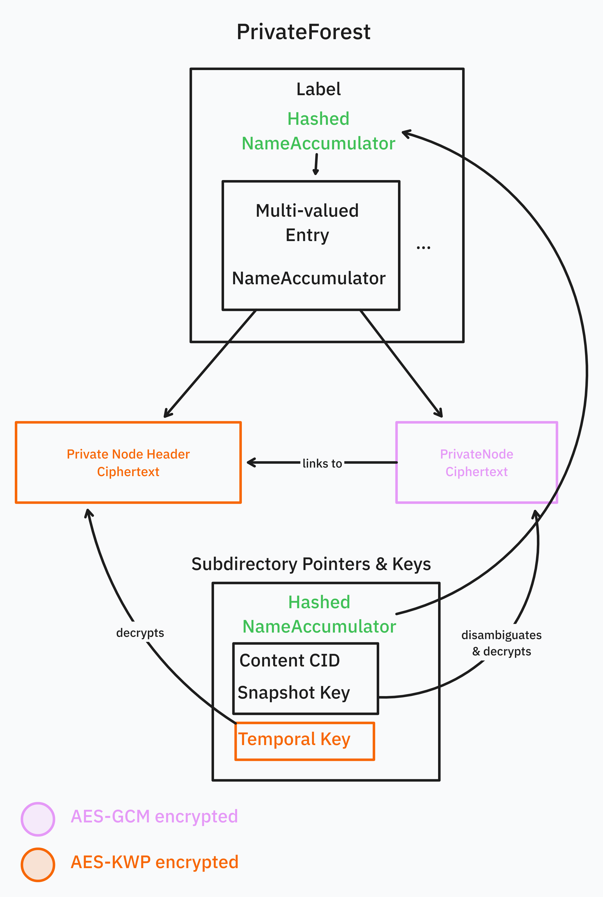
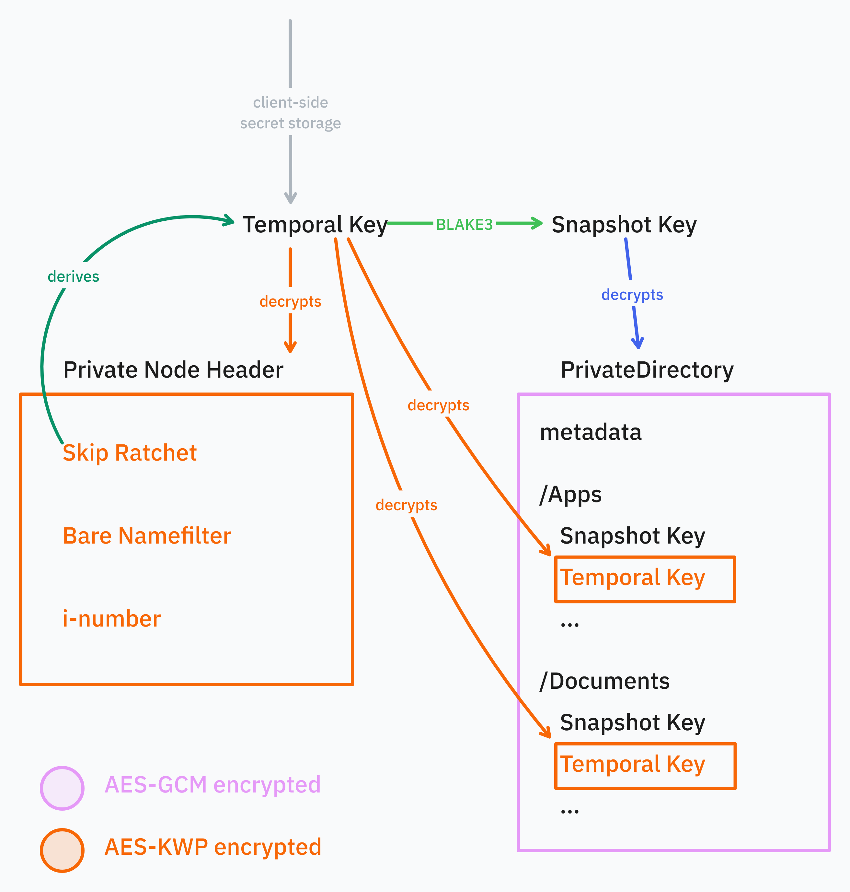

# WNFS Private Partition Specification

# 0 Abstract

The private file system provides granular control over read access along two dimensions: file hierarchy and time. Access is granted with a backward secret mechanism, where being grated access to a subgraph at a point in time is either a single snapshot point in time, or from that time forward -- but never access to the past of a point of history. Similarly, access to a directory implies access to all children nodes, but not to its parents or sibling nodes. Key sharing is an orthogonal concern, and is accomplished out of band, or via the WNFS shared segment.

# 1 Terminology

Encryption adds another dimension to a file system: visibility. The data and file layers are each augmented with cleartext and ciphertext components. While `NameAccumulator`s and multivalues do encode a concept of an encrypted file, we generally only speak of the data layer.


Broadly speaking, there is a "decrypted" layer and an "encrypted" layer.

- The "decrypted" layer defines the type of data you can decrypt given the correct keys. Links between blocks in this layer are references in the HAMT data structure at the "encrypted" layer.
- The "encrypted" layer defines how all of the encrypted data blocks are organized as IPLD data. Links in this layer are CID-links.

These all form graphs, where the nodes and links have different meanings per layer.

| Visibility | Layer | Node        | Link                    |
|------------|-------|-------------|-------------------------|
| Decrypted  | File  | WNFS File   | File Path               |
| Decrypted  | Data  | CBOR Object | `NameAccumulator` + Key |
| Encrypted  | Data  | IPLD Block  | CID                     |

# 2 Encrypted Layer

The encrypted layer hides the structure of the file system that it contains. The data MUST be placed into a flat namespace — in this case a [Merklized](https://en.wikipedia.org/wiki/Merkle_tree) [hash array mapped tire (HAMT)](https://en.wikipedia.org/wiki/Hash_array_mapped_trie). The root node of the resulting HAMT plays a very different role from a file system root: it "merely" anchors this flat namespace, and is otherwise unrelated to the file system. The file system structure will be ["rediscovered" in the decrypted layer (§3)](#3-decrypted-layer).

The encrypted layer is intended to hide as much information as possible, while still permitting write access validation by untrusted nodes. A single file system's encrypted root MAY represent a whole forest of decrypted file system trees. The roots of these trees MAY be completely unrelated. These are referred to as the `PrivateForest`. Since a reader may not know what else there is in the forest — and that it is safer to not reveal this information — we sometimes refer to the it as a ["dark forest"](https://en.wikipedia.org/wiki/The_Dark_Forest).

## 2.1 Ciphertext Blocks

At the encrypted data layer, the private forest is a collection of ciphertext blocks. These blocks SHOULD be smaller than 256 kilobytes in order to comply with the default IPFS block size. Keeping block size small is also useful for reducing metadata leakage - it's less obvious what the file size distribution in the private file system is like if these files are split into blocks.

We refer to the keys in the private forest as 'labels' to disambiguate them from cryptographic keys.

Ciphertext blocks MUST be stored as the leaves of the HAMT that encodes a [multimap](https://en.wikipedia.org/wiki/Multimap). The HAMT MUST have a node-degree of 16, and MUST used [`NameAccumulator`](/spec/nameaccumulator.md)s as the label. See [`rationale/hamt.md`](/rationale/hamt.md) for more information on parameter choice.

### 2.1.1 Data Types

The multimap container is based on the [IPLD HAMT specification](https://ipld.io/specs/advanced-data-layouts/hamt/spec/).

It MUST be represented as a CBOR-encoded Merkle HAMT. The values MUST be a set of [`raw` codec](https://github.com/multiformats/multicodec/blob/master/table.csv#L40) CIDs.

All values in the Merkle HAMT MUST be sorted in binary ascending order by CID and MUST NOT contain duplicates.

```typescript
type PrivateForest = Cbor<{
  structure: "hamt"
  version: "0.1.0"
  root: SparseNode
  accumulator: {
    modulus: ByteArray<256>
    generator: ByteArray<256>
  }
}>

type SparseNode = [
  ByteArray<2>, // Sparse Index
  Array<Entry> // Entries
]

type Entry
  = Cid<Cbor<SparseNode>> // Child node
  | Bucket

// Leaf values
// Invariant: The bucket's label is a prefix of the NameAccumulator hash
type Bucket = Array<[NameAccumulator, Array<Cid>]>

type NameAccumulator = ByteArray<256>
```

Note that `SparseNode` and `Entry` are mutually recursive.

#### 2.1.1.1 `SparseNode`

The core HAMT sparse association of a bitmask to an array of links. This layout removes the need to list all blank links in the array, which is more efficient.

#### 2.1.1.2 `Bucket`

A space optimization delaying the creation of additional layers until 3 collisions occur.

#### 2.1.1.3 `Entry`

An `Entry` node MUST consist of:
* The expanded label (HAMT hash preimage)
* The value for this label

If the HAMT is used as the `PrivateForest` for WNFS, then labels stored SHOULD be 2048-bit `NameAccumulator`s.

If the HAMT is used as the `PrivateForest` for WNFS, then the values stored SHOULD be ciphertexts representing conflicting file system writes to that same path and revision.

## 2.2 Ciphertext Files

The encrypted file layer is a very thin enrichment of the data layer. In particular, it knows about `NameAccumulator`s as labels, and ciphertext blobs as being separate from the expanded `NameAccumulator` inside the multivalued entry.



# 3 Decrypted Layer

The decrypted (or "cleartext") layer is where the actual structure of the file system is rediscovered out of the encrypted layer.

The decrypted layer has two sub-layers: a cleartext data layer, and a cleartext file layer.

## 3.1 Cleartext Data

The cleartext data layer makes use of the pointer machine from the encrypted layer to rediscover the semantically meaningful links in the file system. The private WNFS shares the same metadata structure as the [public WNFS](/spec/public-wnfs.md#metadata). Encryption keys and revision secrets are derived from a [skip ratchet](/spec/skip-ratchet.md).

```typescript
type NameAccumulator = ByteArray<256> // Big-endian encoded 2048-bit unsigned integer.
type Key = ByteArray<32>
type Inumber = ByteArray<32> // Invariant: MUST be prime
type PrivateBacklink = [
  UInt, // number of revisions back
  // encrypted(deriveKey(oldRatchet), cid) where ratchet = inc(oldRatchet, number of revisions back)
  // i.e. the CID is encrypted with the ratchet from the revision that is linked to
  // Also: What is encrypted should be the actual byte representation of a CID (usually 40 bytes),
  // as opposed to the dag-cbor-encoded representation of a CID.
  AesKwp<Cid> // disambiguation CID for revision
]

// deterministically encrypted using deriveKey(ratchet) (see AesGcmDet in notation.md)
type PrivateNodeHeader = {
  ratchet: SkipRatchet
  inumber: Inumber
  name: NameAccumulator
}

// aes-gcm encrypted using hash(deriveKey(parentRatchet))
type PrivateNode
  = PrivateDirectory
  | PrivateFile

type PrivateDirectory = {
  "wnfs/priv/dir": {
    version: "0.2.0"
    headerCid: Cid
    previous: Array<PrivateBacklink>

    // USERLAND
    metadata: Metadata
    entries: Record<string, PrivateRef>
  }
}

type PrivateRef = {
  label: Hash<NameAccumulator> // hash(revisionedName(entry))
  contentCid: Cid // used for disambiguating which value in the multivalue was referred to
  snapshotKey: Key // hash(deriveKey(entryRatchet))
  temporalKey: AesKwp<Key> // encrypt(deriveKey(directoryRatchet), deriveKey(entryRatchet))
}

type PrivateFile = {
  "wnfs/priv/file": {
    version: "0.2.0"
    headerCid: Cid
    previous: Array<PrivateBacklink>

    // USERLAND
    metadata: Metadata
    content: InlineContent | ExternalContent
  }
}

type InlineContent = {
  "inline": ByteArray
}

type ExternalContent = {
  "external": {
    key: Key
    blockSize: Uint64 // in bytes, at max 262,116
    blockCount: Uint64
  }
}
```

See the [validation specification](/spec/validation.md) on requirements for validating this data during deserialization.

A file in the cleartext layer turns into a `PrivateNodeHeader` and `PrivateNode` in the cleartext data layer. Each of these data is then encrypted and put under the same label in the `PrivateForest` as a block of the encrypted data layer:

```typescript
type CiphertextBlock = AesKwp<PrivateNodeHeader> | AesGcm<PrivateNode>

// PrivateForest value block references are Cid<CiphertextBlock>
```

### 3.1.1 Node Headers

Node headers MUST be encrypted with the key derived from the node's skip ratchet: the "snapshot key". Headers MUST NOT grant access to other versions of the associated node. Node headers are in kernel space and MUST NOT be user writable. Refer to [Pointers & Keys](#316-pointers--keys) for more detail.

### 3.1.2 Node Metadata

Node metadata is the userland equivalent of the node's header.

### 3.1.3 Node `previous` Backlinks

The `previous` link provides an encrypted back-pointer to any direct causal dependencies (the previous version of this node). The encryption protects from metadata leakage from agents that do not have access to the relevant node.

The `previous` link MUST be an encrypted CBOR list of CIDs sorted in binary ascending order. This value MUST be encrypted with the same skip ratchet key as referred to in the particular link.

Each CID in the decrypted `previous` links MUST refer to a value from the private forest. Either the list of CIDs is empty or at least one CID MUST refer to a CID from the previous revision.

If the `previous` links contain more than one element, then some CIDs MAY refer to CIDs of even older revisions. `previous` link CIDs MUST NOT refer to values in the private forest from newer revisions.

### 3.1.4 Private File

Private file content has two variants: inlined or externalized. Externalized content is held as a separate node in the bucket. Inlined content is kept alongside (and thus is decrypted with) the header.

#### 3.1.4.1 Externalized Content

Since external content blocks are separate from the header, they MUST have a unique `NameAccumulator` derived from a random key (to avoid forcing lookups to go through the header). If the key were derived from the header's key, then the file would be re-encrypted e.g. every time the metadata changed. See [sharded file content access algorithm](#44-sharded-file-content-access) for more detail.

The block size MUST be at least 1 and at maximum $2^{18} - 28 = 262,116$ bytes, as the maximum block size for IPLD is usually $2^{18}$, but 12 initialization vector bytes and 16 authentication tag bytes need to be added to each ciphertext. It is RECOMMENDED to use the maximum block size. An externalized content block is laid out like this:

```
 0                   1
 0 1 2 3 4 5 6 7 8 9 0 1 2 3 4 5  (bytes)
+-+-+-+-+-+-+-+-+-+-+-+-+-+-+-+-+
| Initialization Vector |       |
+-+-+-+-+-+-+-+-+-+-+-+-+       |
|                               :
:         Encrypted Block       :
:        (blockSize bytes)      |
|                               |
+-+-+-+-+-+-+-+-+-+-+-+-+-+-+-+-+
|        Authentication Tag     |
+-+-+-+-+-+-+-+-+-+-+-+-+-+-+-+-+
```

The block count MUST reference the number of blocks the externalized content was split into. The value of `blockCount` MUST be between $1$ and $2^{32}$, for sensible security margins regarding accidental nonce reuse.

The externalized content's `key` MUST be regenerated randomly whenever the file content changes. If the content stays the same across metadata changes, the snapshot key MAY remain the same across those revisions

NB: Label `NameAccumulator`s MUST be computed as described in the algorithm for [sharded file content access](#44-sharded-file-content-access).

Entries in the private forest corresponding to externalized content blocks MUST have exactly one CID as their multivalue. This CID MUST refer to a ciphertext with exactly `28 + blockSize` bytes, except for the last block with index `blockCount - 1`. The first 12 bytes of the block MUST be an initialization vector, and the rest MUST be the ciphertext including the AES-GCM authentication tag.

If any externalized content blocks exceed the specified `blockSize` or are missing in the private forest despite having a lower index than `blockCount` during file read operations, then these operations MUST produce an error.

### 3.1.5 Private Directory

A private directory MUST contain links to zero or more further nodes. Private directories MAY include userland metadata.

See the section for [Read Hierarchy](#317-read-hierarchy) for more information about the link structure.

### 3.1.6 Pointers & Keys

Keys are always attached to pointers to some data.
The pointer to that that data consists of the hashed `NameAccumulator`, which is used as the label for a multivalue in the private forest and an accompanying CID to disambiguate which value in the multivalue is actually referred to.



NB: This diagram shows an abstract model of how data relates to each other. Some arrows are meant to be interpreted more abstractly and don't have a concrete encoding as data. The box labeled "Subdirectory Pointers & Keys" doesn't exist on its own and is part of the [`PrivateDirectory` schema](#31-cleartext-data). For a different angle and a more concrete diagram see [Section Temporal Key Structure](#3172-temporal-key-structure).

Separating the `PrivateNodeHeader` and `PrivateNodeContent` ciphertext blocks allows a reader that traverses a path to skip reading `PrivateNodeHeader`s on the path, but still read temporally once they reached the end of the path.
However, developers should be aware that such operations wouldn't check the invariant that the `TemporalKey` stored in directories is correctly derived from the respective `PrivateNodeHeader`, so it should only be used in situations that assume there are no malicious or buggy writes, e.g. when doing an operation on locally-computed or already verified data.

#### 3.1.6.1 Temporal Key

Temporal keys give temporal read access to a certain node and its descendants. It MUST be derived from the skip ratchet for that node, incremented to the relevant revision number. This limits the reader to reading from a their earliest ratchet and forward, but never earlier revisions than that.

When added to a private directory, it MUST be encrypted with AES-KWP and the private directory's temporal key. This prevents readers with only a snapshot key from gaining revision read access.

#### 3.1.6.2 Snapshot Key

Snapshot Keys grant access to a single revision snapshot of that node and its children, but no other revisions forward or backward. They MUST be derived from the [Temporal Key](#3161-temporal-key) by hashing it with SHA3.

### 3.1.7 Read Hierarchy

Access in WNFS is fundamentally hierarchical. Access granted to a single node in a DAG implies access to all of its child nodes (and no others). Decryption pointers provide a way to "discover" the structure of the portion of the file system accessible to the viewer. This process is always started from a pointer held by the viewer outside of the file system.

For example, having a decryption pointer to a directory with the `Documents/` and `Images/` directories could look something like this:


Each link in the above picture is looked up in the [encrypted HAMT](#211-data-types), decrypted, and transformed into further decrypted file system nodes. It is sometimes helpful to analogize this process as being similar to lazy loading remote content, though of course with content addressed encrypted-at-rest data the encrypted data could very well be stored locally.

Note that holding the decryption pointer to this particular directory MUST NOT grant access to sibling or parent nodes, nor to other structures rooted in the private forest.

### 3.1.7.1 Temporal Hierarchy

Being a versioned file system, private nodes also have read control in the temporal dimension as well as in the [file read hierarchy](#317-read-hierarchy). An agent MAY have access to one or more revisions of a node, and the associated children in that temporal window.

Given the root snapshot key, you can decrypt the root directory that contains the snapshot keys of all subdirectories, which allow you to decrypt the subdirectories.
It's possible to share the snapshot key of a subdirectory which allows you to decrypt everything below that directory, but not siblings or anything above.


In the above diagram, newer revisions of nodes progress left-to-right. The file hierarchy still runs top-to-bottom: subdirectories are below the directory that contains them. Given any of these boxes, follow the lines to see what data you can decrypt or derive.

Special attention should be paid to the relationship of the skip ratchet to snapshot keys. There is a parallel structure between the skip ratchets and the content hierarchy. The primary difference is that access to _only_ a snapshot key does not grant access to other revisions, where having access to a skip ratchet includes the next revisions and the ability to derive the snapshot key.

### 3.1.7.2 Temporal Key Structure

A viewing agent may be able to view more than a single revision of a node. This information must be kept somewhere that some agents would be able to discover as they walk through a file system, but stay hidden from others. This is achieved per node with a [Temporal Key](#3161-temporal-key). Every revision of a node MUST have a unique skip ratchet, `NameAccumulator`, and i-number.

The skip ratchet is the single source of truth for generating the decryption key. Knowledge of this one internal skip ratchet state is sufficient to grant access to all of the relevant state in the diagram:
* Generate the snapshot key for the current node
* Generate decryption pointers for future versions of this node
* Access to decryption pointers to all child nodes
* Access to the skip ratchets for all child nodes



## 3.2 Cleartext Files

The decrypted (cleartext) file layer is very straightforward: it follows the exact interface as public WNFS files and directories. The primary difference is that while the public file system MUST form a DAG by its hash-linked structure, special care MUST be taken so that the private file system does not form pointer cycles.
These cycles can be detected by checking the name accumulator relationships between parent directories and their children. The child's accumulator needs to be an extension of the parent's accumulator.

# 4 Private Path Representation

WNFS is designed to support being stored with a service provider that can gate write access without the having read access to the file system and learning as little about the private file system hierarchy as possible.
This presents a challenge: If the service provider can't read the submitted writes from clients, how should it decide which writes are valid and which are not?

In WNFS, the solution is to represent private file system paths in a way that makes it possible to use them as the key in the private forest while leaking as little as possible about the path itself.
This means the representation
- must not leak information about the nodes that are part of the path,
- must not be correlatable to other paths and
- must not leak the amount of path segments inside the path.

Using simply the hash of a file path would suffice to satisfy the above conditions, however, we also want to be able to create cryptographically signed certificates that give write access to a  subset of keys in the private forest corresponding to a branch in the private file system hierarchy.

To achieve this, we make use of cryptographic RSA accumulators. For details on how accumulation works, refer to [this paper][RSA accumulators]

### 4.1 Name Accumulator Content

Every private forest label MUST be represented as a 2048-bit positive integer that is smaller than the private forest's RSA modulus (stored in its root).

This integer represents an RSA accumulator commitment, committing all i-numbers of its path as well as a revision secret derived from the skip ratchet.

As an example, let's look at the accumulator for a file at the path `/Docs/University/Notes.md`.
Assuming it's encrypted with a `snapshotKey` and the i-numbers for `Docs`, `University` and `Notes.md` are `inum(docs)`, `inum(uni)`, and `inum(notes)` respectively, then the private forest label is this:

```typescript
accumulate([
  inum(docs),
  inum(uni),
  inum(notes),
  hashToPrime(snapshotKey)
])
```

The function `accumulate` is defined in the [`NameAccumulator` specification](/spec/nameaccumulator.md#TODO) using the modulus and generator stored at the `PrivateForest` root.

### 4.2 Write Access Delegation

Usually the root owner of a file system can easily prove root access to a third party via signing updates to the private forest using their public key associated with the file system or other authorization schemes.

Our goal with WNFS is to enable delegating write access to a branch of the hierarchy similar to how it's possible to restrict read access to certain branches only.

This works by creating a certificate containing both the public key of the peer to delegate to as well as the name accumulator for the path that they have access to.

Extending the example from the section above: If the root owner wants to delegate write access to the directory `/Docs/University/`, they would sign a certificate containing the accumulator `accumulate([inum(docs), inum(uni)])`.

### 4.3 Further Write Access Delegation Proofs

When a recipient of a delegation wants to prove or further delegate write access, they prove that the path that they delegate is a superset of the path segments that they have access to.

This proof is made in the form of a "proof of exponent" as explained in the [name accumulator specification](/spec/nameaccumulator.md#TODO).
The inputs to the proof are then the name accumulator of the path they have access to as a witness and the path they want to delegate further as the commitment.

### 4.3 Write Access Batch Proofs

We assume that third parties checking writes don't have read access to the decrypted file system itself. So when a peer with delegated write access wants to prove that their write is valid, they follow a similar protocol as described in the previous section, except they create proofs of exponents for the labels in the private forest that they modified.

The biggest part of these proofs of exponents can be batched together using the algorithm described in the [name accumulator specification](/spec/nameaccumulator.md#TODO).

### 4.4. Write Access Batch Proof Verification

Verifying a change in a private forest from one root CID to another follows these steps:
1. Compute the diff between the forests to obtain the labels of entries that were created, removed or updated between the two revisions.
2. From the provided certificates, extract all validly signed name accumulators that the writer has access to.
3. Verify provided batch proofs as described in the [name accumulator specification](/spec/nameaccumulator.md#TODO) and match their bases against the validly signed name accumulators from the certificates.


# 4 Algorithms

All algorithms in this section implicitly have access to a `PrivateForest` in their context.

## 4.1 `NameAccumulator` Hash Resolution

`resolveHashedLabel: Hash<NameAccumulator> -> (NameAccumulator, Array<Cid>)`

The private file system is a pointer machine, where pointers MUST be hashes of name accumulators. To resolve a name accumulator hash, look it up in the HAMT. The resulting key-value pair contains the name accumulator hash preimage and a list of at least one CID that points to encrypted private node headers or private nodes.

Looking up a `NameAccumulator` hash in the HAMT works by splitting a hash into its nibbles. For example: a hash `0xf199a877d0...` MUST be split into the nibbles `0xf`, `0x1`, `0x9`, etc.

To split bytes into nibbles, first take the 4 most significant bits of and *then* the 4 least significant bits for each hash byte from byte index 0 to 31. This method matches the common hex encoding of byte strings and reading the hex digits off one-by-one in most languages.

Each nibble MUST be used as an identifier for a `Node`s child `Node`. Starting at the root, find the root `Node`s child by taking the nibble and computing the index of the child node as:

$$\textsf{index} = \textsf{popcount}(bitmask \land ((1 \ll nibble) - 1))$$

If the child is a `Node`, repeat the process of with the next nibble.

If the child is a HAMT bucket of values, iterate that bucket to find one that has a name accumulator that matches given hash. The associated values then contains the ciphertexts and the algorithm is done.

## 4.2 Derive Revisioned `NameAccumulator`s

`toRevisioned : (NameAccumulator, Ratchet) -> NameAccumulator`

Because a node's name accumulator in its header is stable across revisions, it cannot be used for addressing different revisions in the private forest.
In order to do that, the node name accumulator needs to be turned into revision-specific name accumulator for each revision.
This is done by deriving a name segment from the revision's skip ratchet state and accumulating that it the node's name accumulator:

```ts
const revisionSegment = header.ratchet.deriveKeyPrime("wnfs/segment deriv from temporal")
const revisionedName = header.name.add(revsisionSegment)
```

Where
- `deriveKeyPrime` is a variant of the [skip ratchet derive key algorithm](/spec/skip-ratchet.md#21-Key-Derivation), but instead of using normal hashing, it'll use the [name accumulator hash to prime algorithm](/spec/nameaccumulator.md#23-Hash-to-Prime)
- `add` refers to the [name accumulator accumulation algorithm](/spec/nameaccumulator.md#21-Accumulation).

Every private file or directory implicitly links to the name of its next version via the skip ratchet. These implicit links can only be resolved with access to the temporal key that decrypts the `PrivateNodeHeader` and thus the node's skip ratchet. Given the skip ratchet, it's then possible to derive any future revisioned name for the same node by first using the [skip ratchet increase algorithm](/spec/skip-ratchet.md#22-Increasing) to skip to a future skip ratchet state and then deriving the revisioned name. This can be useful for finding the latest state for a certain node. We RECOMMEND using [exponential search](https://en.wikipedia.org/wiki/Exponential_search) to speed this up.

## 4.3 Path Resolution

`resolvePath : (PrivateDirectory, Array<string>) -> Hash<NameAccumulator>`

Paths in the private file system MUST be resolved relative to a parent directory. This directory MAY be at the current revision, or MAY be at an earlier version.

Path resolution can happen in three modes: "current", "seek", and "attach".

### 4.3.1 Current Snapshot

Resolve the current snapshot: only resolve the current snapshot of a version. This only requires a snapshot key for decryption.

### 4.3.2 Seek

For each path segment, look up the most recent version that can be found (as described in the [private versioning algorithm](#42-Private-Versioning)). This requires access to the directory's temporal key.

#### 4.3.3 Attach

A variant of seeking. This mode searches for the latest revision of a node (by its `NameAccumulator` and skip ratchet) and if it is found to differ from the parent's link, a new parent revision MAY be created with an updated link to the file. It is RECOMMENDED that this process then be performed recursively to the highest parent that the agent has write access to. This saves the next viewer from having to seek forward more than is strictly necessary, as this always starts from the parent's link which moves forward monotonically.

In all of these cases the next path segment's directory or file's hash of the `NameAccumulator` MUST be retrieved by accessing the current directory's `directory.entries[segmentName].name`, looking up the private node as described in [`NameAccumulator` Hash Resolution](#41-NameAccumulator-Hash-Resolution) and then decrypting the content node(s) using `directory.entries[segmentName].snapshotKey`.

If this mode is seeking, the `directory.entries[segmentName].temporalKey` needs to be decrypted using the temporal key for the current directory.

##### 4.3.3.1 Example

Consider the following diagram. An agent may only have access to some nodes, but not their parent. The agent is able to create new revisions of files and directories, and link that back to the previous version. Some number of revisions may accrue before this can be fully rooted again. Attachment occurs when a reader with enough rights to perform the attachment inspects the file system and discovers that they can attach this file to its parents.


## 4.4 Sharded File Content Access

`getShards : PrivateFile -> Array<NameAccumulator>`

To calculate the array of HAMT labels for [external content](#3141-externalized-content), add `key` and `concat(key, encode(i))` for each block index `i` of external content to the file's name like so:

```ts
function* shardLabels(key: Key, count: Uint64, name: NameAccumulator): Iterable<NameAccumulator> {
  for (let i = 0; i < count; i++) {
    yield name
      .add(key)
      .add(concat(key, encode(i)))
  }
}
```

- `concat` denotes byte array concatenation,
- `name` is the `NameAccumulator` from the private file's header,
- `encode` is a function that maps a block index to a little-endian byte array encoding of a 64-bit unsigned integer.

## 4.5 Merge

`merge : Array<PrivateForest> -> PrivateForest`

The private forest forms a join-semilattice via the `merge` ( $\land$ ) operation. `merge` is thus:
- [Associative](https://en.wikipedia.org/wiki/Associative_property): $(a \land b) \land c = a \land (b \land c) $
- [Commutative](https://en.wikipedia.org/wiki/Commutative_property): $a \land b = b \land a$
- [Idempotent](https://en.wikipedia.org/wiki/Idempotence): $a \land a = a$

The identity element is the empty HAMT.

These properties are very helpful in the case of an n-ary merge: the merge may be performed in any order, and either in a simple pipeline or with a more sophisticated merge mechanism.

Merklization is also helpful for performance. When the two `PrivateForest`s being merged have the same CID, they're equal and thus nothing has to be done (thanks to idempotence). This also applies recursively: if a HAMT branch or leaf have the same CID, treat both as one node (idempotence).

Otherwise, merge the HAMT `Node`s of each `PrivateForest` together recursively. At each level:
- Find the difference between the `Node` bitmasks. The resulting bitmask is simply the binary-or of the input bitmasks.
- Figure out which children one `Node` adds over the other. Keep the superset of both sets of children (this is an additive merge)
- Recursively apply this algorithm on matching pairs of children nodes, unless they have the same CID.
- When merging buckets of values, match the keys in the bucket entries. Merge the values of matching keys by merging the CID lists using set semantics and keep the CID list sorted. Key-value pairs that only appear in one of the inputs are kept as-is. If the bucket gets bigger than the normal bucket size, split the bucket into its own node, as per its normal splitting semantics described earlier in the document.

### 4.5.1 Blind Merge

The private forest merge algorithm functions completely at the encrypted data layer, and MAY be performed by a third party that doesn't have read access to the private file system at all. As a trade off, this pushes some complexity to read-time. It is possible for multiple "conflicting" file writes to exist at a single revision. In these cases, some tie-breaking MUST be performed, and is up to the reader. Tie breaking MAY be as simple as choosing the smallest CID.


[RSA accumulators]: https://link.springer.com/content/pdf/10.1007/3-540-48285-7_24.pdf
