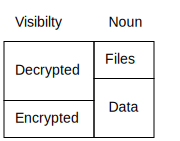
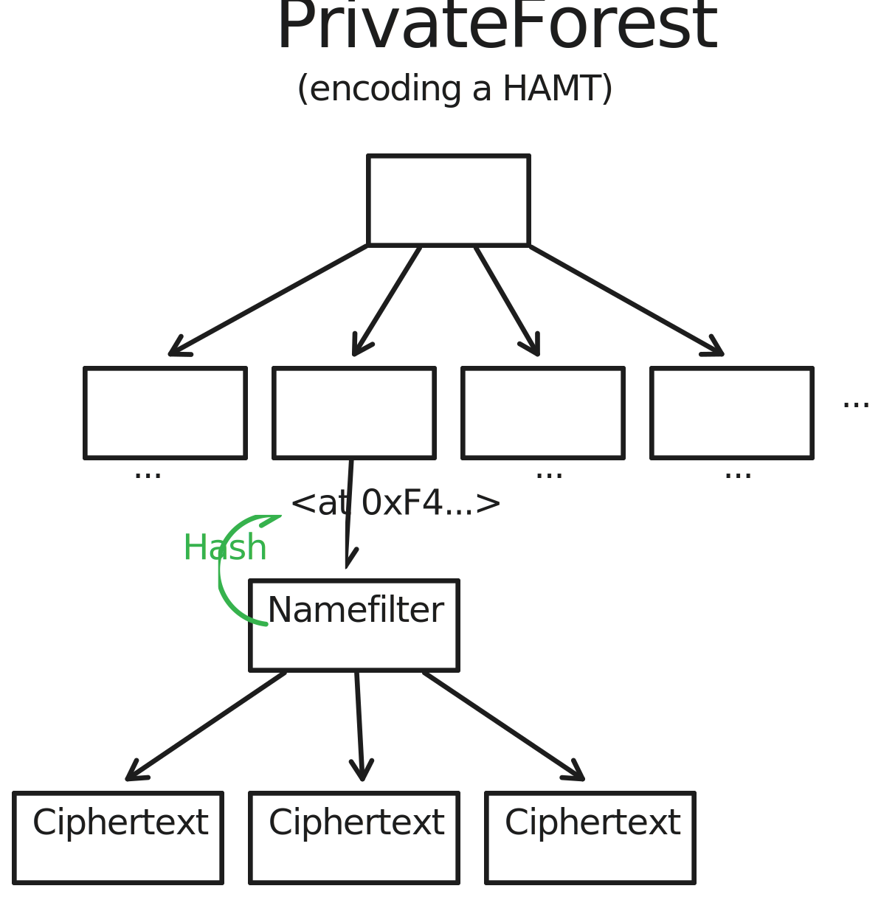
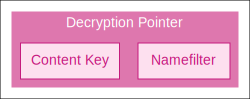
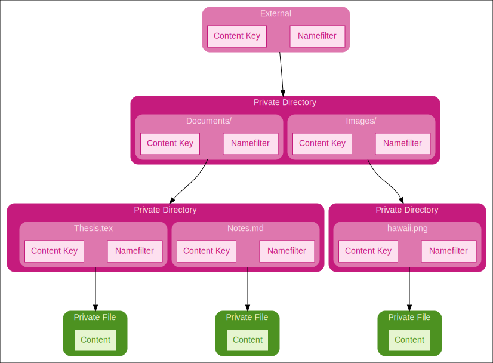
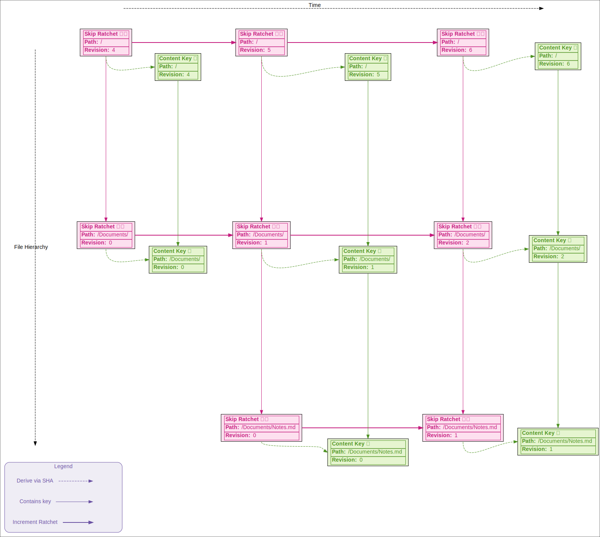
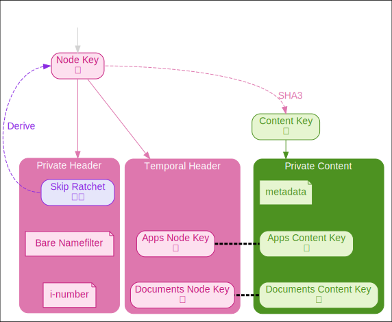
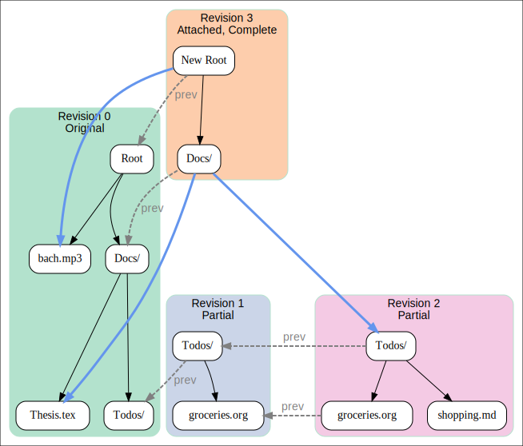

# WNFS Private Partition Specification

# 0 Abstract

The private file system provides granular control over read access along two dimensions: file hierarchy and time. Access is granted with a backward secret mechanism, where being grated access to a subgraph at a point in time is either a single snapshot point in time, or from that time forward -- but never access to the past of a point of history. Similarly, access to a directory implies access to all children nodes, but not to its parents or sibling nodes. Key sharing is an orthogonal concern, and is accomplished out of band, or via the WNFS shared segment.

# 1 Terminology

Encryption adds another dimension to a file system: visibility. The data and file layers are each augmented with cleartext and ciphertext components. While namefilters and multivalues do encode a concept of an encrypted file, we generally only speak of the data layer.



Broadly speaking, there is a "decrypted" layer and an "encrypted" layer.

- The "decrypted" layer defines the type of data you can decrypt given the correct keys. Links between blocks in this layer are references in the HAMT data structure at the "encrypted" layer.
- The "encrypted" layer defines how all of the encrypted data blocks are organized as IPLD data. Links in this layer are CID-links.

These all form graphs, where the nodes and links have different meanings per layer.

| Visibility | Layer | Node        | Link             |
|------------|-------|-------------|------------------|
| Decrypted  | File  | WNFS File   | File Path        |
| Decrypted  | Data  | CBOR Object | Namefilter + Key |
| Encrypted  | Data  | IPLD Block  | CID              |

# 2 Encrypted Layer

The encrypted layer hides the structure of the file system that it contains. The data MUST be placed into a flat namespace — in this case a [Merklized](https://en.wikipedia.org/wiki/Merkle_tree) [hash array mapped tire (HAMT)](https://en.wikipedia.org/wiki/Hash_array_mapped_trie). The root node of the resulting HAMT plays a very different role from a file system root: it "merely" anchors this flat namespace, and is otherwise unrelated to the file system. The file system structure will be ["rediscovered" in the decrypted layer (§3)](#3-decrypted).

The encrypted layer is intended to hide as much information as possible, while still permitting write access validation by untrusted nodes. A single file system's encrypted root MAY represent a whole forest of decrypted file system trees. The roots of these trees MAY be completely unrelated. These are referred to as the `PrivateForest`. Since a reader may not know what else there is in the forest — and that it is safer to not reveal this information — we sometimes refer to the it as a ["dark forest"](https://en.wikipedia.org/wiki/The_Dark_Forest).

## 2.1 Ciphertext Blocks

At the encrypted data layer, the private forest is a collection of ciphertext blocks. These blocks SHOULD be smaller than 256 kilobytes in order to comply with the default IPFS block size. Keeping block size small is also useful for reducing metadata leakage - it's less obvious what the file size distribution in the private file system is like if these files are split into blocks.

Ciphertext blocks MUST be stored as the leaves of the HAMT that encodes a [multimap](https://en.wikipedia.org/wiki/Multimap). The HAMT MUST have a node-degree of 16, and MUST used saturated  saturated [namefilter](/spec/namefilter.md)s as keys. See [`rationale/hamt.md`](/rationale/hamt.md) for more information on parameter choice.

### 2.1.1 Data Types

The multimap container MUST be represented as a CBOR-encoded Merkle HAMT. The values MUST be a set of [`raw` codec](https://github.com/multiformats/multicodec/blob/master/table.csv#L40) CIDs.

All values in the Merkle HAMT MUST be sorted in binary ascending order by CID and MUST NOT contain duplicates.

```typescript
type PrivateForest = Cbor<Hamt<Namefilter, Array<Cid<ByteArray>>>>

type Hamt<L, V> = {
  structure: "hamt"
  version: "0.1.0"
  root: SparseNode<L, V>
}

type SparseNode<L, V> = [
  ByteArray<2>, // Sparse Index
  Array<Entry<L, V>> // Entries
]

type Entry<L, V>
  = Cid<Cbor<SparseNode<L, V>>> // Child node
  | Bucket<L,V>

type Bucket<L, V> = Array<[L, V]> // Leaf values
```

Note that `SparseNode<L, V>` and `Entry<L, V>` are mutually recursive.

#### 2.1.1.1 `SparseNode`

The core HAMT sparse association of a bitmask to an array of links. This layout removes the need to list all blank links in the array, which is more efficient.

#### 2.1.1.2 `Bucket`

A space optimization delaying the creation of additional layers until 3 collisions occur.

#### 2.1.1.3 `Entry`

An `Entry` node MUST consist of:
* The expanded label (HAMT hash preimage)
* The value for this label

If the HAMT is used as the `PrivateForest` for WNFS, then the values stored SHOULD be ciphertexts representing conflicting file system writes to that same path and revision.

## 2.2 Ciphertext Files

The encrypted file layer is a very thin enrichment of the data layer. In particular, it knows about namefilters as labels, and ciphertext blobs as being separate from the expanded namefilter inside the multi-valued entry.



# 3 Decrypted

The decrypted (or "cleartext") layer is where the actual structure of the file system is rediscovered out of the encrypted layer.

The decrypted layer has two sub-layers: a cleartext data layer, and a cleartext file layer.

## 3.1 Cleartext Data

The cleartext data layer makes use of the pointer machine from the encrypted layer to rediscover the semantically meaningful links in the file system. The private WNFS shares the same metadata structure as the [public WNFS](/spec/public-wnfs.md#metadata). Encryption keys and revision secrets are derived from a [skip ratchet](/spec/skip-ratchet.md).

```typescript
type Namefilter = ByteArray<256>
type Key = ByteArray<32>
type Inumber = ByteArray<32>

// aes-gcm encrypted using deriveKey(ratchet)
type PrivateNodeHeader = {
  ratchet: SkipRatchet
  bareName: Namefilter
  inumber: Inumber // Invariant: The `inumber` is included in `bareName`
}

// aes-gcm encrypted using hash(deriveKey(parentRatchet))
type PrivateNode
  = PrivateDirectory
  | PrivateFile

type PrivateDirectory = {
  type: "wnfs/priv/dir"
  version: "0.2.0"
  // aes-gcm encrypted using deriveKey(previousRatchet) where inc(previousRatchet) = ratchet
  previous?: AesGcm<Cbor<{
    header: Cid
    contents: Array<Cid>
  }>>

  // USERLAND
  metadata: Metadata
  entries: Record<string, {
    label: Hash<Namefilter> // hash(saturated(add(deriveKey(ratchet), entryBareName)))
    // and can be used as the key in the private partition HAMT to lookup
    // a (set of) PrivateNode(s) with an entryBareName and entryRatchet from above
    contentKey: Key // hash(deriveKey(entryRatchet))
    contentCid: Cid

    revisionKey: AesKw<Key> // encrypt(deriveKey(ratchet), deriveKey(entryRatchet))
    revisionCid: Cid
  }>
}

type PrivateFile = {
  type: "wnfs/priv/file"
  version: "0.2.0"
  // aes-gcm encrypted using deriveKey(previousRatchet) where inc(previousRatchet) = ratchet
  previous?: AesGcm<Cbor<{
    header: Cid
    contents: Array<Cid>
  }>>

  // USERLAND
  metadata: Metadata
  content: ByteArray | ExternalContent
}

type ExternalContent = {
  key: Key
  blockSize: Uint64 // in bytes, at max 262132
  blockCount: Uint64
}
```

A file in the cleartext layer turns into a `PrivateNodeHeader` and `PrivateNode` in the cleartext data layer. Each of these data is then encrypted and put under the same label in the `PrivateForest` as a block of the encrypted data layer:

```typescript
type PrivateForest =
  Cbor<Hamt<
    Namefilter,
    Array<Cid<AesGcm<PrivateNodeHeader | PrivateNode>>>
  >>
```

### 3.1.1 Node Headers

Node headers MUST be encrypted with the key derived from the node's skip ratchet: the "content key". Headers MUST NOT grant access to other versions of the associated node. Node headers are in kernel space and MUST NOT be user writable. Refer to [Pointers & Keys](#316-pointers--keys) for more detail.

### 3.1.2 Node Metadata

Node metadata is the userland equivalent of the node's header.

### 3.1.3 Node `previous` Backlinks

The `previous` link provides an encrypted back-pointer to any direct causal dependencies (the previous version of this node). The encryption protects from metadata leakage from agents that do not have access to the relevant node.

The `previous` link MUST be an encrypted CBOR list of CIDs sorted in binary ascending order. This value MUST be encrypted with the same skip ratchet key as referred to in the particular link.

Each CID in the decrypted `previous` links MUST refer to a value from the private forest. Either the list of CIDs is empty or at least one CID MUST refer to a CID from the previous revision.

If the `previous` links contain more than one element, then some CIDs MAY refer to CIDs of even older revisions. `previous` link CIDs MUST NOT refer to values in the private forest from newer revisions.

### 3.1.4 Private File

Private file content has two variants: inlined or externalized. Externalized content is held as a separate node in the bucket. Inlined content is kept alongside (and thus is decrypted with) the header.

#### 3.1.4.1 Externalized Content

Since external content blocks are separate from the header, they MUST have a unique namefilter derived from a random key (to avoid forcing lookups to go through the header). If the key were derived from the header's key, then the file would be re-encrypted e.g. every time the metadata changed. See [sharded file content access algorithm](#44-sharded-file-content-access) for more detail.

The block size MUST be at least 1 and at maximum $2^{18} - 28 = 262,116$ bytes, as the maximum block size for IPLD is usually $2^{18}$, but 12 initialization vector bytes and 16 authentication tag bytes need to be added to each ciphertext. It is RECOMMENDED to use the maximum block size. An externalized content block is laid out like this:

```
 0                   1
 0 1 2 3 4 5 6 7 8 9 0 1 2 3 4 5 6  (bytes)
+-+-+-+-+-+-+-+-+-+-+-+-+-+-+-+-+-+
| Initialization Vector |         |
+-+-+-+-+-+-+-+-+-+-+-+-+         |
|                                 :
:         Encrypted Block         :
:        (blockSize bytes)        |
|                                 |
+-+-+-+-+-+-+-+-+-+-+-+-+-+-+-+-+-+
|        Authentication Tag       |
+-+-+-+-+-+-+-+-+-+-+-+-+-+-+-+-+-+
```

The block count MUST reference the number of blocks the externalized content was split into.

The externalized content's `key` MUST be regenerated randomly whenever the file content changes. If the content stays the same across metadata changes, the content key MAY remain the same across those revisions

NB: Label namefilters MUST be computed as described in the algorithm for [sharded file content access](#44-sharded-file-content-access).

Entries in the private forest corresponding to externalized content blocks MUST have exactly one CID as their multi-value. This CID MUST refer to a ciphertext with exactly `28 + blockSize` bytes, except for the last block with index `blockCount - 1`. The first 12 bytes of the block MUST be an initialization vector, and the rest MUST be the ciphertext including the AES-GCM authentication tag.

If any externalized content blocks exceed the specified `blockSize` or are missing in the private forest despite having a lower index than `blockCount` during file read operations, then these operations MUST produce an error.

### 3.1.5 Private Directory

A private directory MUST contain links to zero or more further nodes. Private directories MAY include userland metadata.

See the section for [Read Hierarchy](#317-read-hierarchy) for more information about the link structure.

### 3.1.6 Pointers & Keys

Keys are always attached to pointers to some data.



#### 3.1.6.1 Revision Key

revision keys MUST be derived from the skip ratchet for that node, incremented to the relevant revision number. This limits the reader to reading from a their earliest ratchet and forward, but never earlier revisions than that.

#### 3.1.6.2 Content Key

Content keys MUST be derived from the [Revision Key](#3161-revision-key) by hashing it with SHA3. The content key grants access to a single revision snapshot of that node and its children, but no other revisions forward or backward.

### 3.1.7 Read Hierarchy

Access in WNFS is fundamentally hierarchical. Access granted to a single node in a DAG implies access to all of its child nodes (and no others). Decryption pointers provide a way to "discover" the structure of the portion of the file system accessible to the viewer. This process is always started from a pointer held by the viewer outside of the file system.

For example, having a decryption pointer to a directory with the `Documents/` and `Images/` directories could look something like this:



Each link in the above picture is looked up in the [encrypted HAMT](#211-data-types), decrypted, and transformed into further decrypted file system nodes. It is sometimes helpful to analogize this process as being similar to lazy loading remote content, though of course with content addressed encrypted-at-rest data the encrypted data could very well be stored locally.

Note that holding the decryption pointer to this particular directory MUST NOT grant access to sibling or parent nodes, nor to other structures rooted in the private forest.

### 3.1.7.1 Temporal Hierarchy

Being a versioned file system, private nodes also have read control in the temporal dimension as well as in the [file read hierarchy](#317-read-hierarchy). An agent MAY have access to one or more revisions of a node, and the associated children in that temporal window.

Given the root content key, you can decrypt the root directory that contains the content keys of all subdirectories, which allow you to decrypt the subdirectories.
It's possible to share the content key of a subdirectory which allows you to decrypt everything below that directory, but not siblings or anything above.



In the above diagram, newer revisions of nodes progress left-to-right. The file hierarchy still runs top-to-bottom: subdirectories are below the directory that contains them. Given any of these boxes, follow the lines to see what data you can decrypt or derive.

Special attention should be paid to the relationship of the skip ratchet to content keys. There is a parallel structure between the skip ratchets and the content hierarchy. The primary difference is that access to _only_ a content key does not grant access to other revisions, where having access to a skip ratchet includes the next revisions and the ability to derive the content key.

### 3.1.7.2 Revision Key Structure

A viewing agent may be able to view more than a single revision of a node. This information must be kept somewhere that some agents would be able to discover as they walk through a file system, but stay hidden from others. This is achieved per node with a "revision key". Every revision of a node MUST have a unique skip ratchet, bare namefilter, and i-number.

The skip ratchet is the single source of truth for generating the decryption key. Knowledge of this one internal skip ratchet state is sufficient to grant access to all of the relevant state in the diagram:
* Generate the content key for the current node
* Generate decryption pointers for future versions of this node
* Access to decryption pointers to all child nodes
* Access to the skip ratchets for all child nodes



## 3.2 Cleartext Files

The decrypted (cleartext) file layer is very straightforward: it follows the exact interface as public WNFS files and directories. The primary difference is that while the public file system MUST form a DAG by its hash-linked structure, special care MUST be taken so that the private file system does not form pointer cycles.

# 4 Algorithms

All algorithms MUST have access to a `PrivateForest` in their context.

## 4.1 Namefilter Hash Resolution

`resolveHashedKey: Hash<Namefilter> -> (Namefilter, Array<AesGcm<PrivateNode>>)`

The private file system is a pointer machine, where pointers MUST be hashes of namefilters. To resolve a namefilter hash, look up the hash in the HAMT. The resulting key-value pair MUST contain the full "expanded" namefilter and a list of at least one private node.

Looking up a namefilter hash in the HAMT works by splitting a hash into its nibbles. For example: a hash `0xf199a877d0...` MUST be split into the nibbles `0xf`, `0x1`, `0x9`, etc.

To split bytes into nibbles, first take the 4 most significant bits of and *then* the 4 least significant bits for each hash byte from byte index 0 to 31. This method matches the common hex encoding of byte strings and reading the hex digits off one-by-one in most languages.

Each nibble MUST be used as an identifier for a `Node`s child `Node`. Starting at the root, find the root `Node`s child by taking the nibble and computing the index of the child node as:

$$\textsf{index} = \textsf{popcount}(bitmask \land ((1 \ll nibble) - 1))$$

If the child is a `Node`, repeat the process of with the next nibble.

If the child is a HAMT bucket of values, iterate that bucket to find one that has a namefilter that matches the hash of the namefilter. The associated values then contains the ciphertexts and the algorithm is done.

## 4.2 Private Versioning

`toVersioned : (Namefilter, RevisionKey) -> Namefilter`

Every private file or directory implicitly links to the name (namefilter) of its next version. These implicit links can only be resolved when you have the revision key that allows you to decrypt the `PrivateNodeHeader`. Given a `PrivateNodeHeader` it is possible to construct namefilters for newer versions of this private file or directory by stepping the ratchet forward as far as you want to look ahead. Then, the new namefilter is:

$$saturate(add(deriveKey(inc^n(ratchet)), bareName))$$

Where
- $add$ refers to the [namefilter `add` operation](/spec/namefilter.md#Operation-add)
- $saturate$ refers to the [namefilter `saturate` operation](/spec/namefilter.md#Operation-saturate)
- $deriveKey$ refers to the [skip ratchet `deriveKey` operation](/spec/skip-ratchet.md#Key-Derivation) and
- $inc$ refers to the [skip ratchet increase operation](/spec/skip-ratchet.md#Increasing)

Due to the skip ratchet, it is possible to skip ahead by more than one revision at a time. To do so, choose any $n$ in $inc^n(ratchet)$. When looking for the most recent version of a file, it is RECOMMENDED to first skip to the next small epoch, then the next medium, then large epochs, as long as these revisions exit, and then backtracking once an unpopulated revision is found. A common algorithm for this is [exponential search](https://en.wikipedia.org/wiki/Exponential_search).

## 4.3 Path Resolution

`resolvePath : (PrivateDirectory, Array<string>) -> Hash<Namefilter>`

Paths in the private file system MUST be resolved relative to a parent directory. This directory MAY be at the current revision, or MAY be at an earlier version.

Path resolution can happen in three modes: "current", "seek", and "attach".

### 4.3.1 Current Snapshot

Resolve the current snapshot: only resolve the current snapshot of a version. This only requires a content key for decryption.

### 4.3.2 Seek

For each path segment, look up the most recent version that can be found (as described in the [private versioning algorithm](#42-Private-Versioning)). This requires access to the directory's revision key.

#### 4.3.2.1 Attach

A variant of seeking. This mode searches for the latest revision of a node (by its namefilter and skip ratchet) and if it is found to differ from the parent's link, a new parent revision MAY be created with an updated link to the file. It is RECOMMENDED that this process then be performed recursively to the highest parent that the agent has write access to. This saves the next viewer from having to seek forward more than is strictly necessary, as this always starts from the parent's link which moves forward monotonically.

In all of these cases the next path segment's directory or file's hash of the namefilter MUST be retrieved by accessing the current directory's `directory.entries[segmentName].name`, looking up the private node as described in [Namefilter Hash Resolutions](#41-Namefilter-Hash-Resolution) and then decrypting the content node(s) using `directory.entries[segmentName].contentKey`.

If this mode is seeking, the `directory.entries[segmentName].revisionKey` needs to be decrypted using the revision key for the current directory.

##### 4.3.2.1.1 Example

Consider the following diagram. An agent may only have access to some nodes, but not their parent. The agent is able to create new revisions of files and directories, and link that back to the previous version. Some number of revisions may accrue before this can be fully rooted again. Attachment occurs when a reader with enough rights to perform the attachment inspects the file system and discovers that they can attach this file to its parents.



## 4.4 Sharded File Content Access

`getShards : PrivateFile -> Array<Namefilter>`

To calculate the array of HAMT labels for [external content](#3141-externalized-content), add `key` and `sha3(key || encode(i))` for each block index `i` of external content to the `bareName` like so:

```ts
function* shardLabels(key: Key, count: Uint64, bareName: Namefilter): Iterable<Namefilter> {
  for (let i = 0; i < count; i++) {
    yield bareName
      .add(key)
      .add(sha3(concat(key, encode(i))))
      .saturate()
  }
}
```

- `concat` denotes byte array concatenation,
- `bareName` is the bare namefilter from the private file's header,
- `encode` is a function that maps a block index to a low-endian byte array encoding of a 64-bit unsigned integer.

## 4.5 Merge

`merge : Array<PrivateForest> -> PrivateForest`


The private forest forms a join-semilattice via the `merge` ( $\land$ ) operation. `merge` is thus:
- [Associative](https://en.wikipedia.org/wiki/Associative_property): $(a \land b) \land c = a \land (b \land c) $
- [Commutative](https://en.wikipedia.org/wiki/Commutative_property): $a \land b = b \land a$
- [Idempotent](https://en.wikipedia.org/wiki/Idempotence): $a \land a = a$

The identity element is the empty HAMT.

These properties are very helpful in the case of an n-ary merge: the merge may be performed in any order, and either in a simple pipeline or with a more sophisticated merge mechanism.

Merklization is also helpful for performance. When the two `PrivateForest`s being merged have the same CID, they're equal and thus nothing has to be done (thanks to idempotence). This also applies recursively: if a HAMT branch or leaf have the same CID, treat both as one node (idempotence).

Otherwise, merge the HAMT `Node`s of each `PrivateForest` together recursively. At each level:
- Find the difference between the `Node` bitmasks. The resulting bitmask is simply the binary-or of the input bitmasks.
- Figure out which children one `Node` adds over the other. Keep the superset of both sets of children (this is an additive merge)
- Recursively apply this algorithm on matching pairs of children nodes, unless they have the same CID.
- When merging buckets of values, match the keys in the bucket entries. Merge the values of matching keys by merging the CID lists using set semantics and keep the CID list sorted. Key-value pairs that only appear in one of the inputs are kept as-is. If the bucket gets bigger than the normal bucket size, split the bucket into its own node, as per its normal splitting semantics described earlier in the document.

### 4.5.1 Blind Merge

The private forest merge algorithm functions completely at the encrypted data layer, and MAY be performed by a third party that doesn't have read access to the private file system at all. As a trade off, this pushed some complexity to read-time. It is possible for multiple "conflicting" file writes to exist at a single revision. In these cases, some tie-breaking MUST be performed, and is up to the reader. Tie breaking MAY be as simple as choosing the smallest CID.

